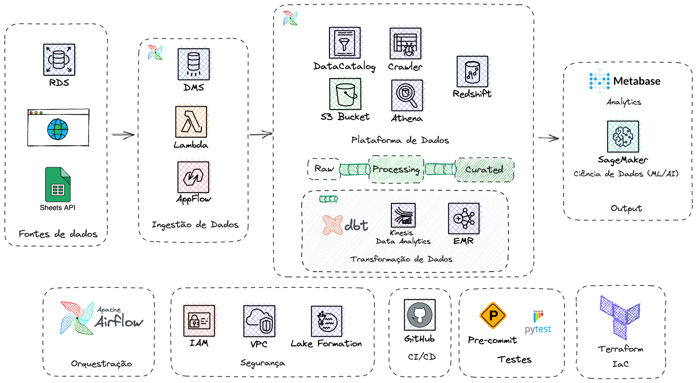

# Engenharia de Dados na AWS
Repositório para compartilhamento de código e conhecimento de engenharia de dados na AWS. Aqui serão compartilhados os exercícios das aulas, e também é o repositório aonde será desenvolvido o projeto prático.

# Encontros
O material dos encontros ficará disponível no diretório [/encontros](/encontros/). Lembrando que a ideia é a primeira parte da aula fazermos exercícios, e a segunda parte da aula fazermos o projeto.

# Projeto
O projeto se encontra dentro do diretório [/projeto](/projeto).

A arquitetura proposta de projeto para a turma de agosto/2023 é a seguinte:

[_Link para a arquitetura no Excallidraw_](Projeto.excalidraw). _Dica: Ao usar [essa extension](https://marketplace.visualstudio.com/items?itemName=pomdtr.excalidraw-editor) você consegue editar a arquitetura usando o próprio VSCode._

Para o primeiro encontro, **fundamentos de python**, vamos trabalhar na extração de dados da web utilizando um script python no serviço [AWS Lambda](https://aws.amazon.com/lambda/).

# Links Úteis
- [Memberkit (Plataforma Aprendizado How)](https://how-bootcamps.memberkit.com.br/)

# Referências de Aprendizado
- [Fundamentals of Data Engineering (by Joe Reis, Matt Housley)](https://www.oreilly.com/library/view/fundamentals-of-data/9781098108298/): Literatura base recomendada em engenharia de dados.
- [AWS Analytics Lens (FREE!)](https://docs.aws.amazon.com/wellarchitected/latest/analytics-lens/analytics-lens.html): Coleção de boas práticas da AWS para construção de arquiteturas analíticas.
  
